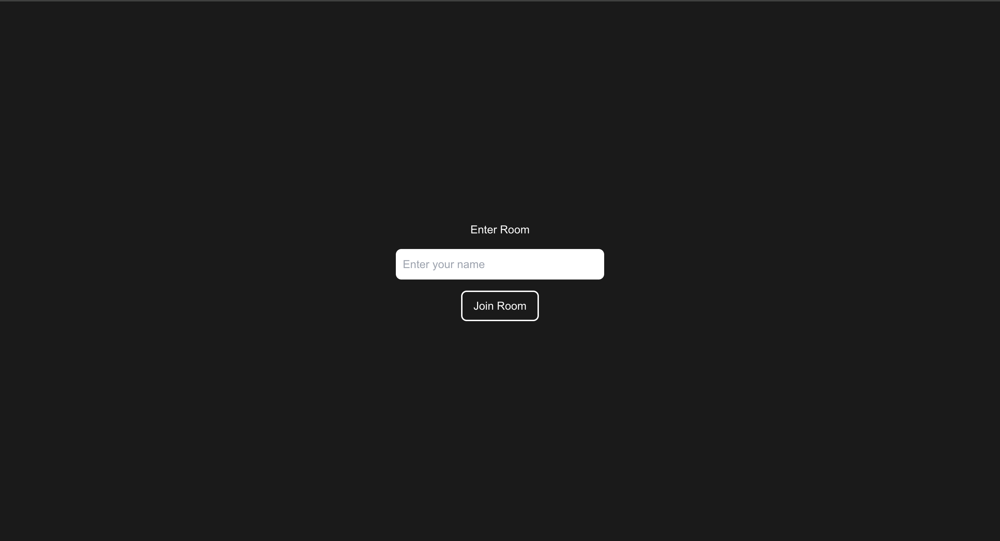

## Getting Started in Local

```
yarn dev
```

## Livekit Server

```
livekit-server --config livekit.yaml
```

## Access

```
http://localhost:3000
```


```
http://localhost:3000/preroom
```



```
http://localhost:3000/room
```


